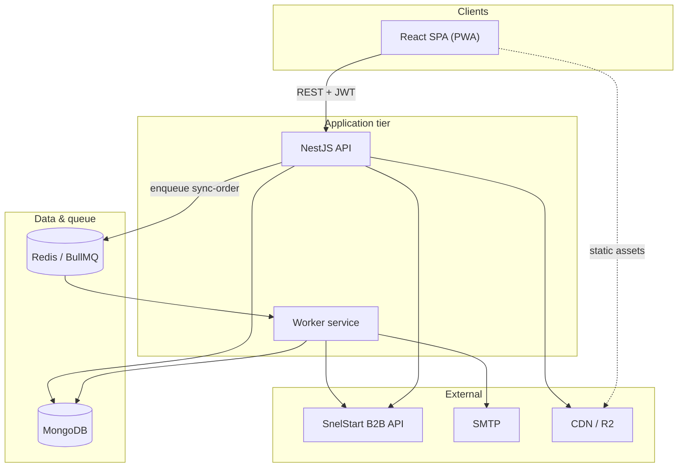
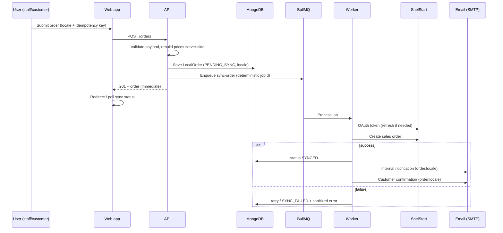

<div align="center">

# SnelStart Order App

### Production-grade B2B ordering platform with SnelStart ERP integration, dual portals, and queue-driven sync.

[](https://github.com/hanbeyoglu/snelstart-order-app/actions/workflows/deploy.yml)
[](package.json)
[](https://nestjs.com/)
[](https://react.dev/)
[](https://www.typescriptlang.org/)
[](docker-compose.yml)
[](https://www.mongodb.com/)
[](https://docs.bullmq.io/)
[](https://redis.io/)
[](apps/web)
[](https://pnpm.io/)
[](#license)

**SnelStart Order App** (also deployed as **DHY Order Platform**) connects wholesale operations to **SnelStart ERP**: staff and customers place orders through a modern web app, while synchronization, retries, and notifications run reliably in the background—without blocking the UI.

<!-- Optional: replace with a short demo GIF -->
<!--  -->

[Features](#key-features) · [Architecture](#architecture) · [Order lifecycle](#order-lifecycle) · [Docker](#docker-setup) · [Development](#development) · [Environment](#environment-variables)

</div>

---

## Overview

SnelStart Order App is a **B2B wholesale ordering system** built for distributors and internal sales teams who need ERP-backed accuracy with a modern UX.

| Capability | Description |
|------------|-------------|
| **B2B ordering** | Catalog, cart, customer-specific pricing, VAT-aware totals, delivery scheduling |
| **SnelStart integration** | OAuth-backed API client, product/customer sync, sales order creation |
| **Staff portal** | Admin, sales rep, and super-admin workflows with reporting and audit visibility |
| **Customer portal** | Isolated self-service ordering for B2B customers |
| **Async sync** | Orders persist locally first; a dedicated worker pushes to SnelStart via BullMQ |

The architecture prioritizes **operational reliability**: HTTP requests return quickly, ERP work is queued, failures are retried, tokens refresh automatically, and the UI reflects sync state through polling and live status updates.

---

## Key features

| Area | Highlights |
|------|------------|
| **Async SnelStart sync** | Non-blocking order creation; background worker handles ERP submission |
| **BullMQ + Redis** | Durable job queue with exponential backoff and deterministic job IDs |
| **Token lifecycle** | Automatic OAuth refresh, 401 recovery, concurrent refresh deduplication |
| **Customer portal** | Scoped login, own orders only, mobile-friendly cart and checkout |
| **Multi-language UI** | Turkish, English, Dutch, German, Arabic (i18next) |
| **Locale-aware emails** | Order language captured at checkout; internal + customer mails follow `order.locale` |
| **PWA** | Installable progressive web app for warehouse and field use |
| **Customer confirmation emails** | Responsive HTML, VAT breakdown, CDN logo support |
| **Internal notifications** | Staff distribution lists with localized templates |
| **Manual email resend** | Re-send customer confirmation using saved order locale |
| **Advanced pagination** | Shared pagination component across list views |
| **Live sync status** | Toasts and order detail reflect `PENDING_SYNC` → `SYNCED` / `SYNC_FAILED` |
| **Roles & permissions** | Layered RBAC beyond coarse roles |
| **Price override engine** | Policy-based limits (full / limited / none) with audit trail |
| **Audit logging** | Security-sensitive and operational events with filtering |
| **Idempotency** | UUID keys prevent duplicate orders on client retry |
| **Delivery scheduling** | Warehouse pickup vs market delivery, ASAP vs scheduled date |
| **Order notes** | Notes flow into SnelStart memo/omschrijving |
| **Reporting** | Sales, margin, VAT, and export-oriented analytics |
| **Object storage** | Product images via MinIO or Cloudflare R2 |

---

## Architecture

The codebase is a **pnpm + Turborepo monorepo** with a shared TypeScript package for validation, email templates, and ERP helpers.

### Stack summary

| Layer | Technologies |
|-------|----------------|
| **Frontend** | React 18, Vite, TypeScript, Zustand, TanStack Query, Framer Motion, react-i18next, vite-plugin-pwa |
| **API** | NestJS 10, Mongoose, JWT/Passport, BullMQ, Swagger, Sentry |
| **Worker** | Node.js, BullMQ consumer, nodemailer, shared package |
| **Data** | MongoDB 7, Redis 7 |
| **Shared** | Zod schemas, email builders, SnelStart URL helpers, price-override rules |

### System diagram



### ASCII overview

```text
┌─────────────┐     HTTPS/JWT      ┌──────────────┐
│  React SPA  │ ─────────────────► │  NestJS API  │
│  (PWA)      │                    └──────┬───────┘
└─────────────┘                           │
                    ┌─────────────────────┼─────────────────────┐
                    ▼                     ▼                     ▼
              ┌──────────┐          ┌──────────┐          ┌─────────────┐
              │ MongoDB  │          │  Redis   │          │ MinIO / R2  │
              │ orders,  │          │ BullMQ   │          │ images      │
              │ users…   │          └────┬─────┘          └─────────────┘
              └──────────┘               │
                                         ▼
                                  ┌──────────────┐
                                  │   Worker     │
                                  │ sync + mail  │
                                  └──────┬───────┘
                                         ▼
                                  ┌──────────────┐
                                  │ SnelStart API│
                                  └──────────────┘
```

### Monorepo layout

```text
snelstart-order-app/
├── apps/
│   ├── api/          # REST API, auth, queues producer, mail settings
│   ├── web/          # Staff + customer SPA
│   └── worker/       # Order sync jobs, post-sync emails
├── packages/
│   └── shared/       # Zod, i18n email templates, validators
├── tests/e2e/        # Playwright
├── docs/screenshots/
├── docker-compose.yml
└── env.example
```

---

## Order lifecycle

End-to-end flow from cart submit to ERP and notifications:



| Step | Behavior |
|------|----------|
| **Validation** | Shared Zod schemas; server-side price trust (client overrides rejected) |
| **Persistence** | `LocalOrder` in MongoDB with creator snapshot, VAT breakdown, `locale` |
| **Queue** | BullMQ job `sync-order`; 5 attempts, exponential backoff |
| **Idempotency** | Same `idempotencyKey` returns existing order; job ID tied to order `_id` |
| **Token handling** | Shared refresh logic; 401 triggers single coordinated retry |
| **UI** | No blocking on SnelStart; list/detail polling and transition toasts |
| **Emails** | After successful sync; language from `order.locale`, RTL for Arabic |

---

## Security & reliability

| Topic | Implementation |
|-------|----------------|
| **Authentication** | JWT (Passport); bcrypt password hashing |
| **Authorization** | Role guards + fine-grained permission decorators |
| **Customer isolation** | Portal users restricted to own `customerId` and `createdByUserId` |
| **Audit trail** | Structured audit log for orders, users, mail, sync events |
| **Secrets** | AES-GCM for integration credentials; strong `JWT_SECRET` enforced in production |
| **Input safety** | DTO/Zod validation; Mongo operator injection guards |
| **Idempotency** | UUID per checkout attempt; stable queue job IDs |
| **Queue retries** | Exponential backoff; max attempts before `SYNC_FAILED` |
| **Error exposure** | Sync errors sanitized before storage/display |
| **Rate limiting** | Configurable API rate limit per minute |
| **Monitoring** | Sentry, health endpoints (`/api/health`, live, ready), optional Uptime Kuma |

---

## Localization

| Feature | Detail |
|---------|--------|
| **UI languages** | `tr`, `en`, `nl`, `de`, `ar` via react-i18next |
| **Persistence** | Browser language detection + user `preferredLanguage` |
| **Order emails** | `locale` sent with `POST /orders`; stored on `LocalOrder` |
| **Fallback chain** | Payload locale → user preference → customer preference → env default |
| **Arabic** | RTL layout in HTML email templates (`dir="rtl"`) |
| **Formatting** | Locale-aware currency/date helpers in the web app |

Staff and customers receive confirmation and notification content in the **language active at order creation**, not the server default.

---

## Email system

| Type | When | Notes |
|------|------|-------|
| **Internal order notification** | After successful SnelStart sync | Configurable TO/CC in mail settings |
| **Customer confirmation** | After sync (auto) or manual resend | Requires valid customer email |
| **Templates** | Shared package | HTML + plain text; VAT lines and delivery blocks |
| **Logo** | CDN-first | `CUSTOMER_ORDER_EMAIL_LOGO_URL` or public `APP_URL` + asset path |
| **Configuration** | DB mail settings + env fallbacks | SMTP host, credentials, default locale |

Mail sending runs in the **worker** on sync success; the API handles **manual resend** with permission checks and audit events.

---

## Screenshots

Place assets under [`docs/screenshots/`](docs/screenshots/). Existing captures:

| Dashboard | Products catalog |
|:--:|:--:|
|  |  |

| Cart | Reports |
|:--:|:--:|
|  |  |

| Customer portal | Audit logs |
|:--:|:--:|
|  |  |

| Mobile responsive |
|:--:|
|  |

**Suggested additions** (add files when available):

| Orders list | Order detail (sync status) |
|:--:|:--:|
| `docs/screenshots/orders.png` | `docs/screenshots/order-detail.png` |

| Email preview | Staff dashboard (dark) |
|:--:|:--:|
| `docs/screenshots/email-preview.png` | `docs/screenshots/dashboard-dark.png` |

---

## Environment variables

Copy [`env.example`](env.example) to `.env` and configure per environment. **Never commit real secrets.**

### Core (API)

| Variable | Required | Example / notes |
|----------|----------|----------------|
| `PORT` | Yes | `3001` |
| `NODE_ENV` | Yes | `development` \| `production` |
| `JWT_SECRET` | Yes | `••••••••` (≥32 chars in production) |
| `ENCRYPTION_MASTER_KEY` | Yes | `••••••••` (≥32 chars in production) |
| `FRONTEND_URL` | Yes | `https://orders.example.com` (CORS) |
| `APP_URL` | Recommended | Public URL for email links and logos |
| `API_RATE_LIMIT_PER_MINUTE` | No | `300` |

### Database & queue

| Variable | Required | Example / notes |
|----------|----------|----------------|
| `MONGODB_URI` | Yes | `mongodb://mongodb:27017/snelstart-order-app` |
| `REDIS_HOST` | Yes | `redis` (Docker) or `localhost` |
| `REDIS_PORT` | Yes | `6379` |
| `REDIS_PASSWORD` | No | `••••••••` if Redis is secured |

### SnelStart

| Variable | Required | Example / notes |
|----------|----------|----------------|
| `SNELSTART_API_BASE_URL` | Yes | `https://b2bapi.snelstart.nl/v2` |
| `SNELSTART_API_AUTH_URL` | Yes | `https://auth.snelstart.nl/b2b/token` |
| `SNELSTART_CLIENTKEY` | Yes* | `••••••••` |
| `SNELSTART_API_SUB_KEY` | Yes* | `••••••••` |
| `SNELSTART_MOCK` | No | `true` for local dev without ERP |
| `SNELSTART_MAX_CONCURRENT` | No | `5` |

\*Not required when `SNELSTART_MOCK=true`.

### SMTP & notifications

| Variable | Required | Example / notes |
|----------|----------|----------------|
| `SMTP_HOST` | For email | `smtp.example.com` |
| `SMTP_PORT` | For email | `587` |
| `SMTP_USER` | For email | `••••••••` |
| `SMTP_PASS` | For email | `••••••••` |
| `SMTP_FROM` | For email | `orders@example.com` |
| `ORDER_NOTIFICATION_EMAILS` | For email | `ops@example.com,sales@example.com` |
| `ORDER_NOTIFICATION_LOCALE` | No | `tr` \| `en` \| `nl` \| `de` \| `ar` (fallback) |
| `CUSTOMER_ORDER_EMAIL_LOGO_URL` | No | `https://cdn.example.com/logo.webp` |

Mail settings can also be stored in MongoDB via the admin UI (overrides env for SMTP recipients/locale).

### Storage (images)

| Variable | Purpose |
|----------|---------|
| `MINIO_*` | Local/dev object storage |
| `CLOUDFLARE_R2_*` | Production CDN-backed uploads |

### Bootstrap & monitoring

| Variable | Purpose |
|----------|---------|
| `INITIAL_SUPER_ADMIN_*` | First super-admin seed (password never logged) |
| `SENTRY_DSN` | Error tracking |
| `SENTRY_ENVIRONMENT` | e.g. `production` |
| `UPTIME_KUMA_PUSH_URL` | Optional heartbeat |

### Frontend (build-time)

| Variable | Purpose |
|----------|---------|
| `VITE_API_URL` | API base URL baked into the SPA (see `docker-compose.yml`) |

---

## Docker setup

Run the full stack:

```bash
cp env.example .env
# Edit .env with production values

docker compose up -d --build
```

| Service | Container | Ports (default) | Role |
|---------|-----------|-----------------|------|
| **web** | `snelstart-web` | `8082 → 80` | Nginx-served React build |
| **api** | `snelstart-api` | `8081 → 3001` | NestJS REST API |
| **worker** | `snelstart-worker` | — | BullMQ consumer + emails |
| **mongodb** | `snelstart-mongodb` | internal | Primary database |
| **redis** | `snelstart-redis` | internal | Queue backend |
| **uptime-kuma** | `snelstart-uptime-kuma` | `3001` | Optional uptime UI |

Infrastructure only (local dev):

```bash
docker compose up -d mongodb redis
```

---

## Development

### Prerequisites

| Tool | Version |
|------|---------|
| Node.js | ≥ 20 |
| pnpm | 9.15 |
| Docker | Recommended for MongoDB + Redis |

### Install & build

```bash
git clone https://github.com/hanbeyoglu/snelstart-order-app.git
cd snelstart-order-app

pnpm install
pnpm build          # shared → api → web → worker
```

### Run locally

```bash
# Terminal 1 — infrastructure
docker compose up -d mongodb redis

# Terminal 2 — API
pnpm --filter @snelstart-order-app/api dev

# Terminal 3 — worker
pnpm --filter @snelstart-order-app/worker dev

# Terminal 4 — frontend
pnpm --filter @snelstart-order-app/web dev
```

| URL | Service |
|-----|---------|
| `http://localhost:5173` | Vite dev server (web) |
| `http://localhost:3001` | API |
| `http://localhost:3001/api/docs` | Swagger |

### Tests

```bash
pnpm --filter @snelstart-order-app/api test
pnpm --filter @snelstart-order-app/api test:cov
pnpm test:e2e                    # Playwright (requires running stack)
```

---

## Production notes

| Topic | Guidance |
|-------|----------|
| **HTTPS** | Terminate TLS at reverse proxy (Caddy, Nginx, Traefik); set `FRONTEND_URL` / `APP_URL` to `https://` origins |
| **JWT & encryption** | Use cryptographically random secrets ≥32 characters; never use defaults in production |
| **Redis** | Persistent volume or managed Redis; required for queue durability across deploys |
| **MongoDB** | Replica set recommended for production; backup `LocalOrder` and audit collections |
| **SMTP** | Use authenticated SMTP (587 STARTTLS or provider API); verify SPF/DKIM for customer mail |
| **Email logos** | Host logo on HTTPS CDN (`CUSTOMER_ORDER_EMAIL_LOGO_URL`); many clients block relative/blocked URLs |
| **CORS** | `FRONTEND_URL` must match the exact browser origin |
| **Worker scaling** | Run at least one worker instance; scale horizontally with shared Redis (same queue name) |
| **SnelStart** | Store credentials encrypted; monitor token refresh failures in logs/Sentry |

Example reverse-proxy snippet (Nginx):

```nginx
location /api/ {
  proxy_pass http://127.0.0.1:3001/api/;
  proxy_set_header Host $host;
  proxy_set_header X-Forwarded-Proto $scheme;
}
location / {
  proxy_pass http://127.0.0.1:8082/;
}
```

---

## CI/CD

GitHub Actions ([`.github/workflows/deploy.yml`](.github/workflows/deploy.yml)) typically:

1. Install dependencies (`pnpm`)
2. Build `packages/shared`
3. Build and test API
4. Build frontend
5. Run Playwright E2E
6. Build worker
7. Deploy via SSH + `docker compose up -d --build`

---

## Health & monitoring

```http
GET /api/health
GET /api/health/live
GET /api/health/ready
```

| Tool | Use |
|------|-----|
| **Sentry** | API error and performance traces |
| **Uptime Kuma** | External uptime + push heartbeats |
| **Docker healthchecks** | Container orchestration |

---

## Future improvements

| Initiative | Benefit |
|------------|---------|
| **WebSockets / SSE** | Real-time sync status without polling |
| **Analytics pipeline** | Deeper sales forecasting and cohort views |
| **Invoice PDFs** | Customer-facing documents post-sync |
| **Multi-tenant** | Separate ERP tenants per distributor |
| **Payment integrations** | Card/SEPA flows before ERP posting |
| **Push notifications** | Mobile alerts for sync and delivery updates |

---

## License

This repository is **proprietary**. Source is visible for portfolio and evaluation; copying, redistribution, or commercial reuse requires explicit permission.

---

<div align="center">

**Built for modern B2B wholesale operations — reliable ERP sync, clear permissions, and a portal customers actually use.**

[⬆ Back to top](#snelstart-order-app)

</div>
